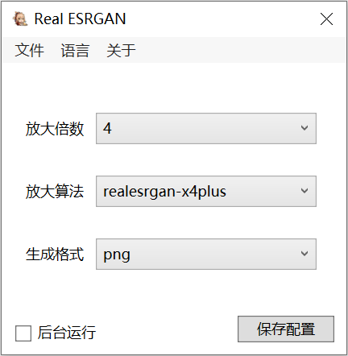

# Real-ESRGAN-GUI-WPF

[English](#english) | [中文](#中文)

---

## English

### Index

- [Feature](#feature)
- [HowToUse](#howtouse)
- [Build](#build)
- [Contribute](#contribute)
- [License](#license)

### Feature

- A lightweight WPF GUI wrapper for the Real-ESRGAN command-line tool.
- Supports drag-and-drop files directly onto the window or the program icon.
- Multiple upscaling models available: `realesrgan-x4plus`, `realesrgan-x4plus-anime`, and `realesr-animevideov3`.
- Adjustable scale factors (2x, 3x, 4x) depending on the selected model.
- Output format selection: JPG, PNG, or WebP.
- Optional background (hidden) mode for the conversion process.
- Multi-language UI support: Simplified Chinese, Traditional Chinese, and English.

### HowToUse

- **Scale:** the magnification factor you want to apply to the input image. Note that only the `realesr-animevideov3` model supports 2x and 3x; other models work at 4x only.
- **Model:** the upscaling algorithm used by Real-ESRGAN.
- **Extension:** the output image format (JPG, PNG, or WebP).
- **Hide Process:** when checked, the underlying command-line window will not be displayed during processing.
- **Save Config:** stores the current settings (language, scale, model, extension, and process visibility) to a local XML configuration file. The window position is also saved on exit.
- Usage is twofold: drag and drop image files into the main window, or drag and drop files onto the program icon directly.
- The program also accepts file paths via command-line arguments, which is useful for file association or "Send To" scenarios.

### Build

- Requires Visual Studio 2019 or higher with .NET Framework 4.7.2 targeting pack installed.
- All Real-ESRGAN runtime components (realesrgan.exe, vcomp140.dll, vcomp140d.dll, and model files) are embedded as resources and extracted automatically on first run to `%LocalAppData%\Real_ESRGAN_GUI`.
- No additional runtime dependencies beyond .NET Framework 4.7.2.

### Contribute

- Welcome to contribute! There is currently no contribution list.

### License

- The project is licensed under the [GPL-3.0 license](LICENSE).

---

## 中文

### 目录

- [特性](#特性)
- [如何使用](#如何使用)
- [构建](#构建)
- [贡献](#贡献)
- [许可证](#许可证)

### 特性

- 基于 WPF 的 Real-ESRGAN 命令行程序轻量级图形界面。
- 支持将图片文件直接拖拽到程序窗口或程序图标上进行处理。
- 提供多种放大算法可选：`realesrgan-x4plus`、`realesrgan-x4plus-anime` 以及 `realesr-animevideov3`。
- 支持调整放大倍数（2x、3x、4x），具体可选范围取决于当前选择的算法。
- 支持选择生成格式：JPG、PNG 或 WebP。
- 可选的“后台运行”模式，勾选后处理过程中不显示命令行窗口。
- 支持多语言界面：简体中文、繁体中文和英文。

### 如何使用

- **放大倍数**的意思是你希望图片被放大的倍数。注意：只有 `realesr-animevideov3` 算法支持 2 倍和 3 倍放大，其他算法仅支持 4 倍。
- **放大算法**的意思是 Real-ESRGAN 所使用的超分辨率模型。
- **生成格式**的意思是你希望输出的图片格式（JPG、PNG 或 WebP）。
- **后台运行**勾选后，处理过程中将不会弹出命令行窗口。
- **保存配置**会将当前的界面语言、放大倍数、放大算法、生成格式和后台运行状态保存到本地的 XML 配置文件中。程序退出时也会自动保存窗口位置。
- 使用方法有两种：将图片文件拖拽到主程序窗口内，或将文件拖拽到主程序图标上。
- 程序同样支持通过命令行参数传入文件路径，适用于文件关联或“发送到”菜单的场景。

### 构建

- 需要 Visual Studio 2019 或更高版本，并安装 .NET Framework 4.7.2 目标包。
- 所有 Real-ESRGAN 运行组件（realesrgan.exe、vcomp140.dll、vcomp140d.dll 以及模型文件）均以嵌入资源的形式打包，首次运行时自动解压到 `%LocalAppData%\Real_ESRGAN_GUI` 目录。
- 除 .NET Framework 4.7.2 外，无需额外运行时依赖。

### 贡献

- 欢迎贡献！目前还没有贡献名单。

### 许可证

- 该项目的许可证为 [GPL-3.0 许可证](LICENSE)。